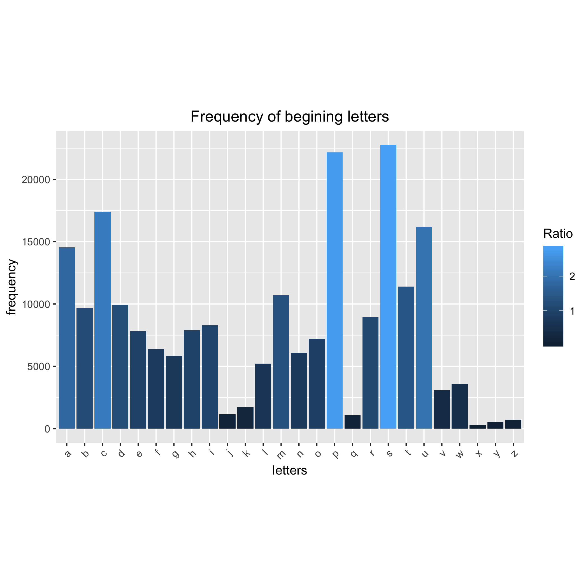

make-activity
=============
For more info look at [this activity](http://stat545-ubc.github.io/automation04_make-activity.html) from [STAT 545](http://stat545-ubc.github.io). This fully developed example shows:

  [x] How to run an R script non-interactively  
  [x] How to use `make`  
  
    - to record which files are inputs vs. intermediates vs. outputs
    - to capture how scripts and commands convert inputs to outputs
    - to re-run parts of an analysis that are out-of-date  
  [x] The intersection of R and `make`, i.e. how to  
  
    - run snippets of R code
    - run an entire R script
    - render an R Markdown document (or R script)
  
  [x] The interface between RStudio and `make`  
  [x] How to use `make` from the shell  
  [x] How Git facilitates the process of building a pipeline
  
------------------------------------
File                        |  | 
----------------------------|------|
[**make**](https://github.com/STAT545-UBC-students/hw09-zeeva85/blob/master/Makefile)|
[**R script 1**](https://github.com/STAT545-UBC-students/hw09-zeeva85/blob/master/freq_let.R)|
[**R script 2**](https://github.com/STAT545-UBC-students/hw09-zeeva85/blob/master/freq_plot.R)|
[**master rmd generator**](https://github.com/STAT545-UBC-students/hw09-zeeva85/blob/master/reportgen.txt)|
[**words.txt**](https://raw.githubusercontent.com/STAT545-UBC-students/hw09-zeeva85/master/words.txt)|
[**python script**](https://github.com/STAT545-UBC-students/hw09-zeeva85/blob/master/download.py)|


Original output


### Modified @zeeva85 for hw09

Final output

 


## Pipeline of the automation analysis:
### makefile2dot
[makefile2dot][makefile2dot] is used yo produce the proceeding image in the `make` pipeline
The output is like this:

```
make output.png # output.dot is automatically removed after png is made
```


makefile2dot: https://github.com/vak/makefile2dot


## The following calls have been added to the `make` pipeline:-

#### make

1. If the word file is avaliable in`/usr/share/dict/words`, it is copied from the location as `words.txt`, if unvaliable a `.py` script downloads the word list from an online source. This evaluation is done using an`if` `else` Bourne-again shell (`Bash`) also known as (`sh`) snippets script is used to make the call between download or copy.

2. An `R` script that contains a for loop is used to created a concatenated string vector of 26 elements with `^` followed by `letters` such as `^S` using `paste0` to be used as `regex` input to match the `words.txt`. This vectors is then matched and computed into a tibble displaying the frequency of each letter in the start position (begining) of each word in the `words.txt` dataset. The table is saved as `freq_let.tsv`.

3. Another `R` script is then used to generate the plots using the `tsv` producing the output `freq_let.png` (the snippets are commented out as they seem too chunky) in the `makefile`.

4. A different approach is taken where a master file `reportgen.txt` is used as a starting point using a combination of `readLines` and `writeLines` and with different lines to be read so different `.rmd`'s could be generated, `report.rmd` or `report2.rmd`. This reduces the number of `rmd` in the repo, less clutered. `report.rmd` is the complete report a submission of [@zeeva85][@zeeva85] along with the original work from [@jennyBC][@jennyBC]. `report2.rmd` is a condensed submission of [@zeeva85][@zeeva85] modified version. They can be accesed via analysis1/ analysis2 (see below). The `rmd` generates an `md` and `html` file which is kept as per the original assignment. The usage to access the individual reports:-

```
make analysis1 # jennyBC version 
make analysis2 # zeeva85 version
make           # complete report with @zeeva85 + @jennyBC 

```

[@jennyBC]: https://github.com/STAT545-UBC/make-activity
[@zeeva85]: https://github.com/STAT545-UBC-students/hw09-zeeva85

#### clean

1. Ussage to clean 

```
make clean_old # @jennyBC
make clean2 # @zeeva85
make clean # cleans all version, includes removal of output.png.

```

## Non `R` scripts and snipperts used in `make`
- `.py` python script is used to download data
-  `sh` snippet evaluates it to download using `IF` `ELSE` when `words.txt` is unavailable
- `.py` python script is used to make the make file workflow graph for better visualizaton
