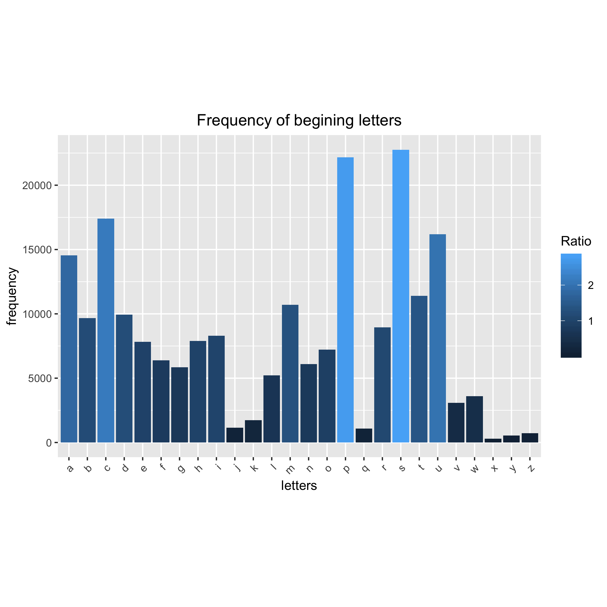

I computed the letter usage at the begining of each word in the list, i.e. Frequency of each letter at the start position of each word in the word list, etc.

The most frequent letter at the begining is S.

### Here is a histogram of the frequency of the word list that begins with all the available letters.
  
  

  
**Jenny Bryan** 
  
\newline  
  
On most *nix systems, the file `/usr/share/dict/words` contains a bunch of words. A total 235886 words is contained on my machine.

I computed the length of each word, i.e. the number of characters, and tabulated how many words consist of 1 character, 2 characters, etc.

The most frequent word length is 9.

Here is a histogram of word lengths.

